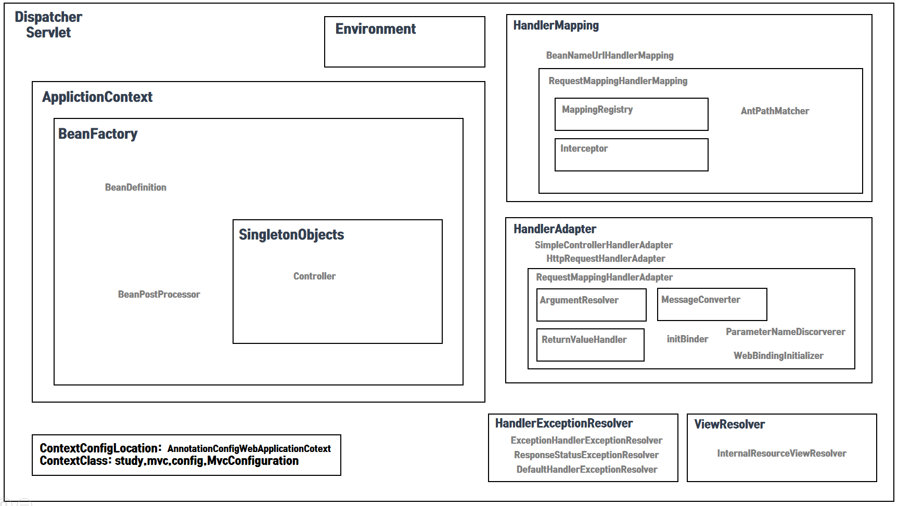

### Dispatcher Servlet 초기화 과정

#### BeanFactory

##### BeanFactory 생성

###### HandlerMapping (RequestMappingHandlerMapping)

> HandlerMapping 인터페이스의 구체 클래스 중 **RequestMappingHandlerMapping** 는 BeanDefinition 중 Controller 와 RequestMapping Annotation 을 식별하여
> **MappingRegistry** 에 보관하고 있다가 요청이 들어왔을 때 연결시켜주는 중요한 기능을 수행한다.

1. 초기화

- **초기화**: AbstractHandlerMethodMapping#initHandlerMethods()
- **유효성 검사**: RequestMappingHandlerMapping#isHandler()
- **검색**: AbstractHandlerMethodMapping#detectHandlerMethods()
- **등록**: AbstractHandlerMethodMapping#registerHandlerMethod()

2. ApplicationContext 주입(Aware)
- Interceptor 설정
    - BeanFactory 에서 MappedInterceptor 검색 후 추가

###### HandlerAdapter (RequestMappingHandlerAdapter)

> HandlerAdapter 인터페이스의 구체 클래스 중 **RequestMappingHandlerAdapter** 는 Controller 를 실행하고 결과값을 처리하는  
> 중요한 기능을 수행한다.

1. 생성자
- HttpMessageConverter 추가
    - 문자열 변환기: StringHttpMessageConverter
    - byte 배열 변환기: ByteArrayHttpMessageConverter
    - Dom, Stream 등 변환기: SourceHttpMessageConverter
    - Form, MultiPart 변환기: AllEncompassingFormHttpMessageConverter

2. 초기화
- ControllerAdvice 검색 후 내부 리소스 보관(Cache)
    - @ModelAttribute
    - @InitBinder
    - RequestBodyAdvice
    - ResponseBodyAdvice

- [HandlerMethodArgumentResolver](/documents/class-config/RequestMappingHandlerAdapter-config.md) 추가

- [ReturnValueHandler](/documents/class-config/RequestMappingHandlerAdapter-config.md) 추가

###### Controller

> 실제 요청에 대한 처리가 실행되는 객체